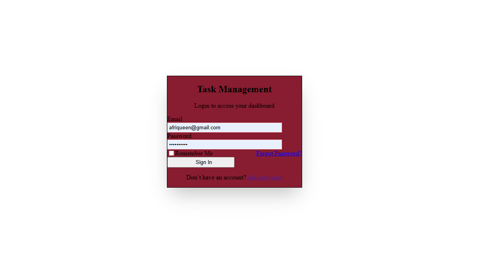
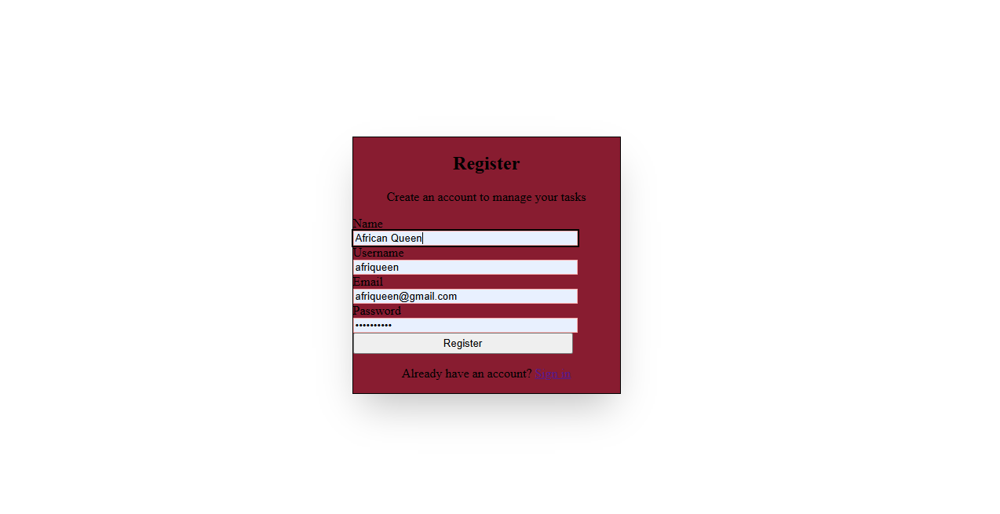
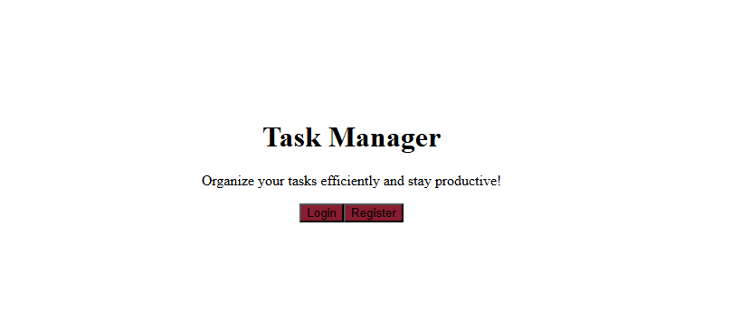
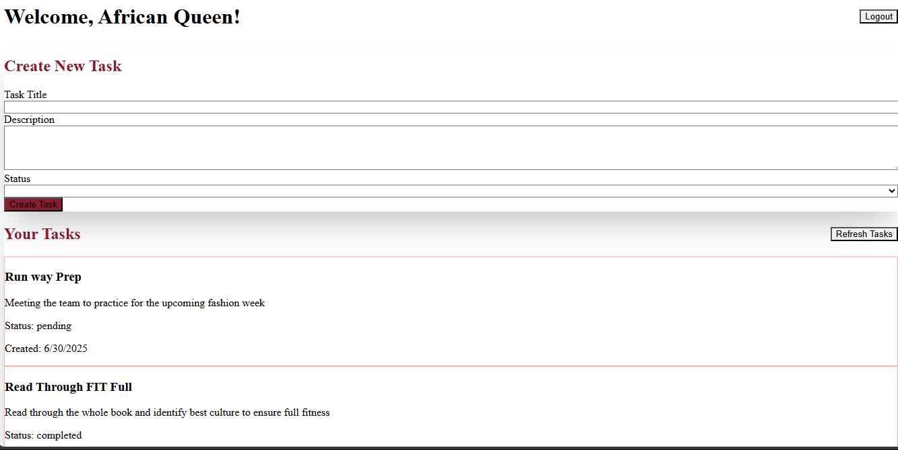

# 🗂️ Task Manager Application

## 📌 Project Overview

A full-stack **MERN (MongoDB, Express.js, React.js, Node.js)** task management application with JWT-based authentication. Users can:

- Register and log in
- Create, update, and delete tasks
- Interact via both the **web interface** and **command-line tools (like cURL or Postman)** for API calls

---

## ⚙️ Setup Instructions

### 🧾 Prerequisites

- Node.js (v18+)
- MongoDB (local or MongoDB Atlas)


### 🖥️ Server Setup

```bash
cd server
pnpm install
pnpm add express mongoose bcryptjs cors dotenv jsonwebtoken multer
cp .env.example .env
````

Update your `.env` file:

```env
MONGO_URI=mongodb://localhost/task-manager
PORT=5000
JWT_SECRET=your_jwt_secret
```

Start the backend server:

```bash
pnpm run dev
```

---

### 🌐 Client Setup

```bash
cd client
pnpm install
cp .env.example .env
```

Update your `.env` file:

```env
VITE_API_URL=http://localhost:5000
```

Start the frontend client:

```bash
pnpm run dev
```

---

### 🔓 Access

Open your browser at: [http://localhost:5173](http://localhost:5173)

---

## 🧪 API Access

You can interact with the backend **via the website UI** or using **command-line tools** like:

* 🧰 [Postman](https://www.postman.com/)
* 🐚 `curl`
* 🧱 HTTP clients (like axios/fetch)

### Example cURL Request:

#### register
```bash
curl -X POST http://localhost:5001/api/auth/register \
-H "Content-Type: application/json" \
-d '{"name": "Test User", "username":"testuser","email":"test@example.com","password":"password123"}'
```
#### Login

```bash
curl -X POST http://localhost:5001/api/auth/login \
  -H "Content-Type: application/json" \
  -d '{"email":"test@example.com", "password":"password123"}'
```


## 📡 API Documentation

### 🔐 Authentication

#### `POST /api/auth/register`

* Body:

```json
{
  "name": "string",
  "username": "string",
  "email": "string",
  "password": "string"
}
```

#### `POST /api/auth/login`

* Body:

```json
{
  "email": "string",
  "password": "string"
}
```

---

### ✅ Tasks

| Method | Endpoint                     | Description       |
| ------ | ---------------------------- | ----------------- |
| GET    | `/api/tasks`                 | Get all tasks     |
| GET    | `/api/tasks/:id`             | Get one task      |
| POST   | `/api/tasks`                 | Create a task     |
| PUT    | `/api/tasks/:id`             | Update a task     |
| DELETE | `/api/tasks/:id`             | Delete a task     |

Sample create task body:

```json
{
  "title": "My Task",
  "description": "Details about the task",
  "status": "completed",
}
```

---

### 🗂️ Categories

| Method | Endpoint          | Description           |
| ------ | ----------------- | --------------------- |
| GET    | `/api/categories` | Get all categories    |
| POST   | `/api/categories` | Create a new category |

Body:

```json
{
  "name": "Work"
}
```

---

## 🌟 Features Implemented

* ✅ JWT-based authentication
* ✅ Full task CRUD support
* ✅ Task categorization
* ✅ File uploads for attachments
* ✅ Comments on tasks
* ✅ CLI and web API usage
* ✅ Responsive UI using TailwindCSS
* ✅ Error handling and form validation

---

## 📸 Screenshots


### 🔐 Login Screen



### 🧍 Register Screen



### 🏠 Landing Page View



### ➕ Create Task




---

## 🛠️ Technologies Used

* **Frontend:** React, TailwindCSS, Vite
* **Backend:** Node.js, Express.js
* **Database:** MongoDB (Atlas or Local)
* **Authentication:** JWT
* **HTTP Client:** Axios, custom hook (`useApi`)
* **Form Handling:** React Hook Form

## 🧼 Clean Project Structure

```
.
├── client/             # React frontend
├── server/             # Node + Express backend + MongoDB
├── .env                # Environment variables
├── README.md
└── ...
```

